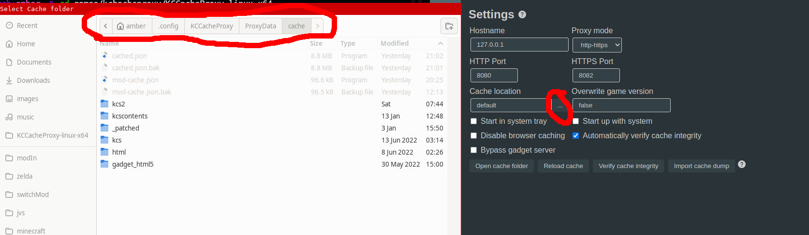
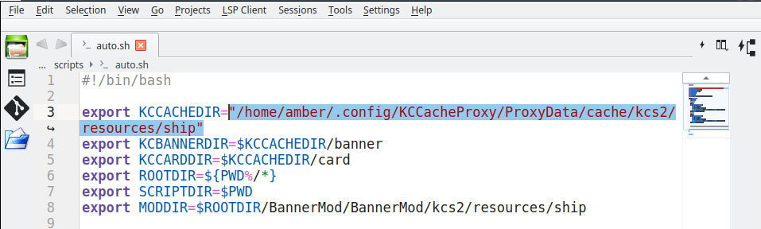

# README kancolle-cardpatcher

kancolle-cardpatcher is a collection of scripts used to patch Kantai Collection assets with KCCacheProxy. These scripts require [ffmpeg](https://ffmpeg.org/download.html). If you are using Windows you will also need bash shell. I recommend using [Git Bash](https://gitforwindows.org/). 
(currently only patches common and rare destroyers)

## Table of Contents

- [Usage](#usage)
- [Support](#support)

## Usage

Open  in your text editor and change line 3 to KCCacheProxy's cache folder.

Run . It should generate images in BannerMod. Once this is done, open KCCacheProxy and install the mod by selecting 'Add Local Mod' and picking 'BannerMod.mod.json'.

## Mod Installation

Download the [latest release](https://github.com/Amberarch/kancolle-cardpatcher/releases/) of the mod and unzip it. Open KCCacheProxy, select 'Add Local Mod', and open 'BannerMod.Mod.json'
